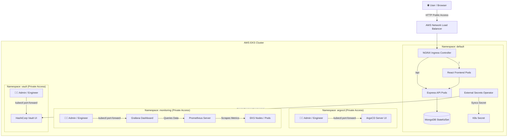

## 🏗️ System Architecture

### Key Technical Highlights
1.Infrastructure as Code (IaC): Modular Terraform code provisioning EKS, VPC, Subnets, EBS CSI Driver, and Helm releases automatically.

2.GitOps Continuous Delivery: Zero-downtime cluster state synchronization using ArgoCD.

3.Enterprise DevSecOps & Secret Management: Dynamic secret injection using HashiCorp Vault (KV-v2 Engine) integrated with External Secrets Operator (ESO).

4.Production-Grade Ingress Architecture: Single AWS Network Load Balancer (NLB) for public application traffic while enforcing Zero-Trust private access (port-forwarding) for internal DevOps management dashboards.

5.Full-Stack Observability: Production monitoring using Prometheus metrics aggregation and Grafana dashboards.

## Table of Contents

Prerequisites

Project File Structure

Step 1: AWS Credentials & IAM Setup

Step 2: Infrastructure Provisioning with Terraform

Step 3: Cluster Connectivity & Verification

Step 4: Secret Management with HashiCorp Vault & ESO

Step 5: Deploying MERN Stack & Monitoring Apps

Step 6: How to Access Application & Admin Dashboards

Step 7: System Verification & Troubleshooting Commands

Step 8: Resource Clean Up

## Prerequisites
Ensure the following CLI tools are installed on your local machine:

AWS CLI: aws --version

Terraform: terraform --version

Kubectl: kubectl version --client

Helm: helm version

1. Project File Structure

.
├── README.md                        # Project documentation
├── argocd-apps                      # ArgoCD GitOps Application Wrappers
│   ├── external-secrets-app.yaml    # External Secrets Operator Deployer
│   ├── mern-app.yaml                # MERN Stack Application Deployer
│   ├── monitoring-app.yaml          # Prometheus/Grafana Stack Deployer
│   └── vault-app.yaml               # HashiCorp Vault Deployer
├── ebs-csi-policy.json              # IAM Policy definition for EBS CSI
├── k8s-manifests                    # Core Kubernetes Manifests
│   ├── backend-deployment.yaml      # Express API Deployment & Service
│   ├── cluster-secret-store.yaml    # ESO connection manifest for Vault
│   ├── frontend-deployment.yaml     # React Frontend Deployment & Service
│   ├── ingress.yaml                 # NGINX Ingress Controller Routing Manifest
│   ├── mongo-external-secret.yaml   # Vault secret fetching definition
│   └── mongo-statefulset.yaml       # MongoDB StatefulSet & PVC Storage
└── terraform-eks                    # Infrastructure as Code (IaC)
    ├── main.tf                      # EKS, VPC, EBS CSI, ArgoCD & NGINX Ingress Modules
    ├── outputs.tf                   # Output Variables
    ├── providers.tf                 # AWS & K8s Provider configs
    └── variables.tf                 # Variable definitions

2. Step 1: AWS Credentials & IAM Setup
Configure AWS CLI:

aws configure

Verify Credentials:

aws sts get-caller-identity

3. Step 2: Infrastructure Provisioning with Terraform
Provision the VPC, EKS Cluster, EBS CSI Driver, ArgoCD, and NGINX Ingress Controller automatically via Terraform:

# Navigate to terraform directory
cd terraform-eks

# Initialize Terraform
terraform init

# Review execution plan
terraform plan

# Apply infrastructure changes (~15-20 minutes)
terraform apply -auto-approve

# Return to root directory
cd ..

4. Step 3: Cluster Connectivity & Verification

1.Connect to EKS Cluster:

aws eks update-kubeconfig --region us-west-2 --name mern-devsecops-cluster

2.Verify Worker Nodes, Storage Driver & NGINX Ingress:

kubectl get nodes

kubectl get pods -n kube-system -l app.kubernetes.io/name=aws-ebs-csi-driver

kubectl get pods -n ingress-nginx

5. Step 4: Secret Management with HashiCorp Vault & ESO

1.Deploy Vault Application Wrapper:

kubectl apply -f argocd-apps/vault-app.yaml

Wait until Vault pod is running:

kubectl get pods -n vault -w

2.Store Secrets inside Vault Engine:

# Enter Vault Pod CLI
kubectl exec -it hashicorp-vault-0 -n vault -- sh

# Enable KV-v2 Engine & Store Secrets

vault kv put secret/mongodb MONGO_USER="rootadmin" MONGO_PASS="SuperSecret123!"

vault kv get secret/mongodb

# Exit pod
exit

3.Pass Vault Token to Kubernetes Secret:

kubectl create secret generic vault-token --from-literal=token="root" -n default

**Production Note:** In this lab environment, a `root` token is used for seamless execution. For production environments, it is recommended to replace root tokens with **Kubernetes Auth Method** or **AppRole Auth Engine** enforced by fine-grained Vault policies.

4.Deploy External Secrets Operator (ESO):

kubectl apply -f argocd-apps/external-secrets-app.yaml

6.Step 5: Deploying MERN Stack & Monitoring Apps
Apply all ArgoCD Application Wrappers to start automated synchronization:

kubectl apply -f argocd-apps/

ArgoCD will continuously sync this repository and automatically deploy workloads into monitoring and default namespaces.

7.Step 6: How to Access Application & Admin Dashboards

🌐 1. Public MERN Application (AWS Load Balancer)
Retrieve your AWS Network Load Balancer (NLB) external DNS name:

kubectl get svc -n ingress-nginx ingress-nginx-controller -o jsonpath='{.status.loadBalancer.ingress[0].hostname}'

MERN Frontend Application: http://<YOUR-AWS-NLB-DNS>/

🔒 2. Internal Admin Dashboards (Secure Port-Forwarding)
For security best practices, internal DevOps dashboards are isolated and accessed via local port-forwarding:

1.ArgoCD Dashboard:

kubectl port-forward svc/argocd-server -n argocd 8080:443

👉 Open: https://localhost:8080 (Username: admin | Retrieve password using kubectl get secret argocd-initial-admin-secret -n argocd -o jsonpath="{.data.password}" | base64 -d)

2.Grafana Monitoring:

kubectl port-forward svc/monitoring-stack-grafana -n monitoring 3000:80

👉 Open: http://localhost:3000 (User: admin | Pass: admin)

3.HashiCorp Vault UI:

kubectl port-forward svc/hashicorp-vault -n vault 8200:8200

👉 Open: http://localhost:8200 (Method: Token | Token: root)

8. Step 7: System Verification & Troubleshooting Commands

# Check status of all cluster pods
kubectl get pods -A

# Check status of Ingress rules
kubectl get ingress -n default

# Check ExternalSecrets synchronization with Vault
kubectl get externalsecrets -n default
kubectl get secret mongodb-secret -n default

# Inspect MERN Backend application logs
kubectl logs -l app=mern-backend -n default -f

# Check ArgoCD application sync status
kubectl get applications -n argocd

9. Step 8: Resource Clean Up
To prevent unnecessary AWS cloud charges, tear down resources in order:

# 1. Delete Kubernetes Applications

kubectl delete -f argocd-apps/

kubectl delete namespace monitoring vault argocd

# 2. Destroy AWS Infrastructure via Terraform

cd terraform-eks

terraform destroy -auto-approve

💡 Key Technical Challenges & Solutions

1. Zero-Trust Admin Dashboard Isolation:

a.Challenge: Exposing sensitive tools (ArgoCD, Grafana, Vault) on public Ingress routes creates security vulnerabilities and complex subpath/rewrite issues.

b.Solution: Isolated all internal dashboards within private cluster namespaces, using kubectl port-forward for developer access while leaving only the public-facing MERN application on the AWS Load Balancer Ingress.

2. Secure DB Credential Injection:

a.Challenge: Preventing sensitive database passwords from being exposed in Git.

b.Solution: Integrated HashiCorp Vault with External Secrets Operator (ESO) to automatically sync KV-v2 engine secrets into Kubernetes Native Secrets at runtime.